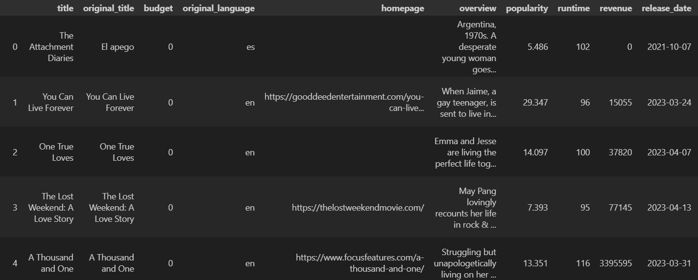

# data-sourcing-challenge

## Overview

* This is a tool that will retreive movie reviews from the NYT api and then retreive all available information about these movies from The movie database api.
* The program then combines these reviews and information and presents it in a user friendly format that is both clear and trimmed of unecessary data

## Sample output
